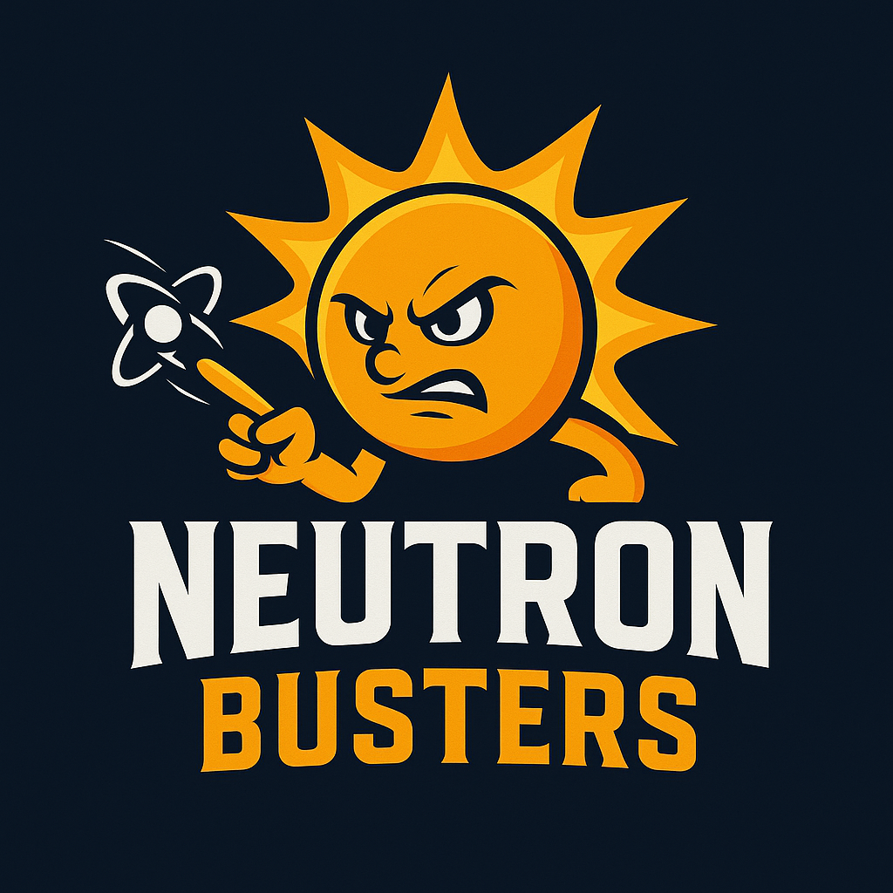

# Team Neutron Busters

- Please refer to [main.ipynb](https://github.com/arz03/CME_Analysis/blob/main/notebooks/main.ipynb)  
  

Analyzing ISRO Aditya-L1's SWIS payload to detect and predict ICME (Interplanetary Coronal Mass Ejections).  
Successfully processing over 2 million records spanning 420 days of data and identifying several peaks in solar wind parameters that occurred around the time of CME events from various catalogues such as SOHO, CACTUS, and HELCATS.
